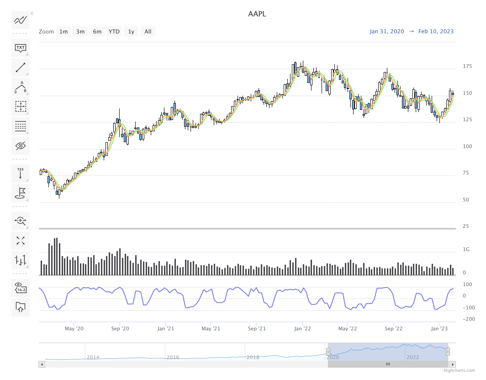

<!-- README.md is generated from README.Rmd. Please edit that file -->

# highcharter.stock

The goal of highcharter.stock is to provide a simple wrapper to the
highcharts stock GUI and associated technical indicators library

## Installation

You can install the development version of highcharter.stock like so:

``` r
remotes::install_github("zac-garland/highcharter.stock")
```

## Example

``` r
library(highcharter.stock)
highchartStock("AAPL",from = as.Date("2000-01-01"))
```


